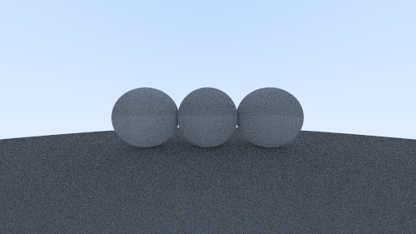

# Raytracer

This is a simple raytracer written in C++

## About

Current render output:


Some difficulties with refraction:


Another render:


## TODO

- [ ] Make multithreaded for faster rendering
- [ ] Add REPL interpreter for interactive rendering

## Setup

```shell
$ mkdir build
$ cd build
$ cmake ..
$ make
$ ./raytracer
```