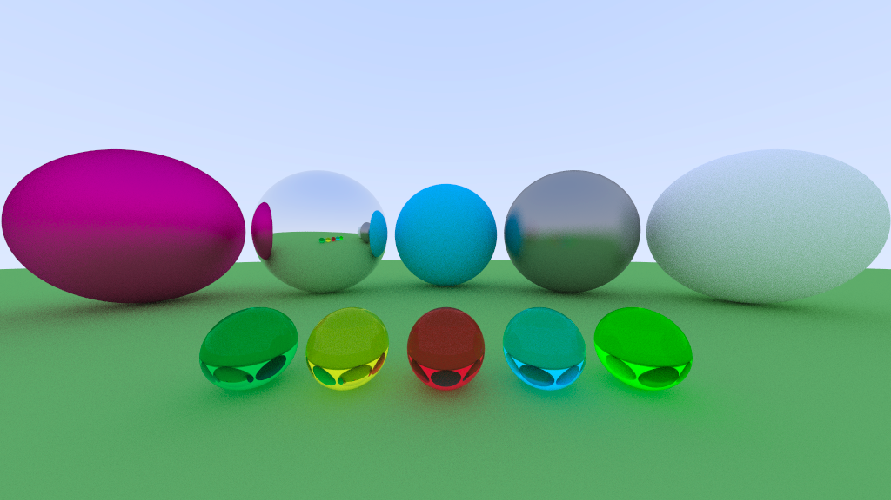

# Raytracer

This is a simple raytracer written in C++ using the SFML library for rendering the scene in a window.

## About

Implementation of a simple path raytracer. Implements different materials (Lambertian/Specular/Dielectric).
The raytracer is multithreaded and utilizes all available resources (`std::thread::hardware_concurrency()`).

After rendering, the rendered scene is saved to a file``render.png` in the present working directory.

Current render output:




## TODO

- [x] Make multithreaded for faster rendering
- [ ] Add more physically based rendering approaches
- [ ] Add REPL interpreter for interactive rendering

## Setup

```shell
$ mkdir build
$ cd build
$ cmake ..
$ make
$ ./raytracer
```